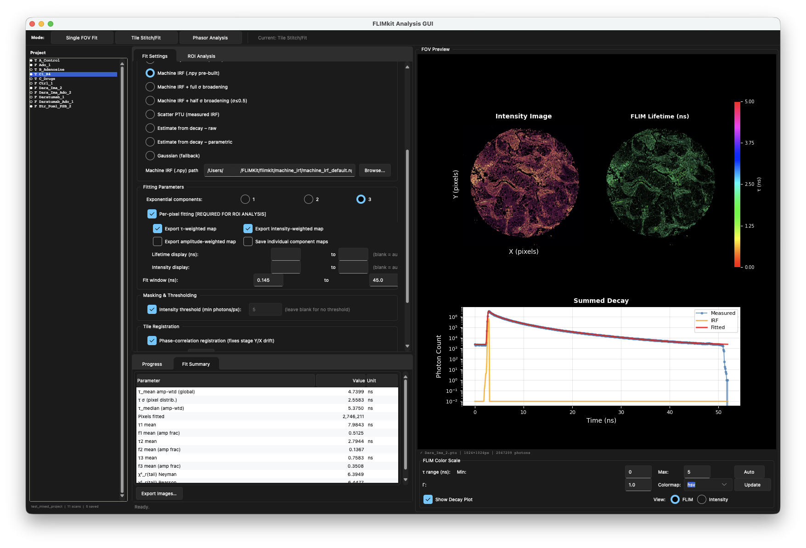

#  FLIMKit

[](https://github.com/FLIMKit/FLIMKit/actions/workflows/test.yml)
[](https://github.com/FLIMKit/FLIMKit#installation)
[](LICENSE.md)
[](https://doi.org/10.5281/zenodo.21931131)

> **Warning:** Active development. Cross-validate results with other software before drawing conclusions. API and file formats may change without deprecation.

FLIMKit is a Python toolkit for FLIM data from FLIM microscope systems and common TCSPC / time-tag formats (PicoQuant `.ptu`, Becker & Hickl `.sdt`, ISS time-tag, Photonscore `.photons`). Built as a drop-in for FLIM microscope software, with two workflows:

- **Reconvolution fitting**: mono/bi/tri-exponential lifetime fitting with full IRF deconvolution, per-pixel and summed modes, multi-tile ROI stitching, batch processing, timelapse and z-stack analysis (a stack fitted as one FOV with a shared reference lifetime), a settable fit window with exclusion bands (drop reflection peaks mid-decay), and optional time-varying background correction (FLIMfit-style, from a measured fluorophore-free reference)
- **Lifetime distribution fitting**: Gaussian and Lorentzian continuous α(τ) distributions (Lakowicz §4.11.2), per-ROI and per-pixel maps with GPU acceleration
- **Phasor analysis**: calibrated phasor plots, interactive elliptical cursors, spatial filtering (gaussian/median/wavelet), two-component decomposition, automatic peak detection, session save/load

Four entry points: desktop GUI, guided terminal UI, CLI scripts, Python API.

[Examples repo](https://github.com/FLIMKit/FLIMKit-Examples.git) | [Full documentation](https://github.com/FLIMKit/FLIMKit/wiki)

## GUI



Desktop GUI showing reconvolution fitting with per-pixel lifetime maps, summed decay curve, and full IRF deconvolution. The residual graph now displays beneath the tail fit for detailed fit quality assessment.

## Installation

Python ≥ 3.12 required (3.14 recommended, official builds use 3.14).

```bash
git clone https://github.com/FLIMKit/FLIMKit.git
cd FLIMKit
python install.py             # auto-detects GPU and installs the right backend
python validate_installation.py   # 10 checks - all should pass
```

For development work (PyInstaller + test dependencies):

```bash
python install.py --dev
```

Or download the compiled app from the Releases tab (no Python needed).

## Docker / TrueNAS SCALE

A pre-built image is available on Docker Hub. It runs the full desktop GUI in a browser via xpra (no installation needed on the client).

**Pull and run:**

```bash
docker run -d \
  -p 14500:14500 \
  -v /path/to/your/data:/data \
  --name flimkit \
  alex1075/flimkit:latest
```

Then open **http://localhost:14500** in your browser. PTU files and data should be placed in the folder you mount to `/data` - use the file dialog inside the app to navigate there.

**TrueNAS SCALE (Custom App):**

1. Apps → Discover Apps → Custom App
2. Paste the contents of `docker/docker-compose.yaml` from this repo
3. Edit the volume paths to match your pool (e.g. `/mnt/tank/microscopy:/data`)
4. Deploy - TrueNAS will pull the image automatically

**Build from source** (required if you want to push your own changes):

```bash
python docker/build_docker.py        # builds linux/amd64, pushes to Docker Hub
```

Requires Docker Desktop with buildx. On Apple Silicon, buildx cross-compiles for `linux/amd64` automatically.

## Usage

### Desktop GUI

```bash
python main.py
```

Five tabs: **Single FOV Fit**, **Tile Stitch / Fit**, **Batch ROI Fit**, **Machine IRF Builder**, **Phasor Analysis**. The right panel shows an FOV preview (intensity image + summed decay) and switches to the interactive phasor view when that tab is active. The Single FOV Fit tab has an Analysis toggle next to the input file: switch it to **Z-stack** to pick a folder of `region_zX.ptu` slices (one PTU per z-slice, e.g. a Leica `.sptw` workspace) and fit the whole stack as one FOV with a shared reference lifetime. The FOV Preview shows the intensity when you pick the folder and the fitted FLIM after fitting, with a z-slider (shown only for a z-stack) to scroll through depth. In a project folder, a z-stack appears as one collapsed entry (a `Z` tag) in the browser and reloads its fitted stack when selected.

### Terminal UI

```bash
python main.py --cli
```

### CLI

```bash
python fit_cli.py --ptu data.ptu --machine-irf machine_irf_default.npy --nexp 2
python phasor_cli.py --ptu data.ptu --irf irf.xlsx
```

### Synthetic data

Generates FLIM data with a known ground truth (sample PTU + matching IRF PTU + a JSON of the parameters used) for cross-software validation. Optional reflection peaks, pile-up and background let you reproduce specific artefacts; `--sdt` also writes Becker & Hickl versions.

```bash
python synth_cli.py --out ./validation --tau 3.0,0.8 --amps 0.7,0.3 --photons 1e5
```

### Python API

```python
from flimkit.phasor_launcher import launch_phasor
state = launch_phasor('data.ptu', irf_path='irf.xlsx')

# With spatial phasor filtering
state = launch_phasor('data.ptu', irf_path='irf.xlsx',
                      phasor_filter='gaussian', filter_kwargs={'sigma': 1.5})
```

## Supported formats

FLIMKit auto-detects the file type and routes every format through one loader (`FLIMFile` in `flimkit.formats`), so the fitting, phasor, stitching, and ROI workflows are identical whatever the instrument wrote.

| Format | Extension | Loads as | Reader | Validated against real files |
|---|---|---|---|---|
| PicoQuant PTU | `.ptu` | Fitting + phasor | [`ptufile`](https://github.com/cgohlke/ptufile) | Yes (32 files) |
| Becker & Hickl SDT | `.sdt` | Fitting + phasor | [`sdtfile`](https://github.com/cgohlke/sdtfile) | Yes (bit-identical) |
| Photonscore LINCam | `.photons` | Fitting + phasor | [`photonsfile`](https://github.com/alex1075/photonsfile) | Yes (bit-exact vs SDK) |
| PicoQuant BIN | `.bin` | Fitting + phasor | [`ptufile`](https://github.com/cgohlke/ptufile) | Upstream |
| PicoQuant PHU | `.phu` | Fitting (no image) | [`ptufile`](https://github.com/cgohlke/ptufile) | Upstream |
| SimFCS B&H | `.b&h` | Fitting + phasor | [`lfdfiles`](https://github.com/cgohlke/lfdfiles) | Upstream (no time axis in file) |
| SimFCS BHZ | `.bhz` | Fitting + phasor | [`lfdfiles`](https://github.com/cgohlke/lfdfiles) | Upstream (no time axis in file) |
| ImSpector FLIM TIFF | `.tif`, `.tiff` (sniffed) | Fitting + phasor | [`tifffile`](https://github.com/cgohlke/tifffile) | Upstream |
| ISS Vista TDFLIM | `.iss-tdflim`, `.tdflim` | Fitting + phasor | [`lfdfiles`](https://github.com/cgohlke/lfdfiles) | Upstream |
| FLIM LABS imaging | `.json` (sniffed) | Fitting + phasor | [`phasorpy`](https://github.com/phasorpy/phasorpy) | Upstream |
| ISS time-tag | `.tagtime`, `.tagchannel`, `.tagdecay` | Fitting + phasor | FLIMKit (from ISS spec) | **No** |
| ISS FD-FLIM | `.ifli` | Phasor only | [`lfdfiles`](https://github.com/cgohlke/lfdfiles) | Upstream |
| SimFCS referenced | `.ref`, `.r64` | Phasor only | [`lfdfiles`](https://github.com/cgohlke/lfdfiles) | Upstream (no frequency in file) |
| PhasorPy OME-TIFF | `.ome.tif` (sniffed) | Phasor only | [`tifffile`](https://github.com/cgohlke/tifffile) | Upstream |
| FLIM LABS phasor | `.json` (sniffed) | Phasor only | [`phasorpy`](https://github.com/phasorpy/phasorpy) | Upstream |
| ISS intensity image | `.ifi` | Intensity only | FLIMKit (from ISS spec) | **No** |

"Upstream" means decoding is delegated to a maintained third-party reader that is tested against real files by its own author; FLIMKit has not independently re-validated it. "Sniffed" means the extension is ambiguous, so the file is identified by content, not by its name.

Formats whose files carry no time axis (`.b&h`, `.bhz`) or no modulation frequency (`.ref`, `.r64`) will prompt for the missing value, since fits and the universal circle cannot be computed without it.

**PicoQuant `.ptu` (T3 mode):**

- PicoHarp T3 (Leica FALCON / STELLARIS)
- HydraHarp v1/v2 T3
- TimeHarp 260 N / P T3
- MultiHarp / generic T3

Decoding and image reconstruction use Christoph Gohlke's [`ptufile`](https://github.com/cgohlke/ptufile). FLIMKit's original T3 decoder, checked against `ptufile` on 32 real files (Leica, PicoQuant, Chroma, Zeiss; image and point-mode), is kept as a reference in the separate `flim-native-decoders` repository (see `flimkit/formats/PTU/NOTICE.md`).

**Becker & Hickl `.sdt` (SPC TCSPC):** the histogram / image `.sdt` files SPCM saves (per-pixel decays already binned). Read with Christoph Gohlke's [`sdtfile`](https://github.com/cgohlke/sdtfile); FLIMKit's own decoder, written from Becker & Hickl's official SPCM documentation and checked bit-for-bit against `sdtfile` on real files, is kept as a reference in `flim-native-decoders`. Thanks to Becker & Hickl for supporting this (see `flimkit/formats/BH/NOTICE.md`).

**Photonscore `.photons` (LINCam, D7 container):** the position-sensitive photon-counting files from Photonscore's LINCam systems. Read with [`photonsfile`](https://github.com/alex1075/photonsfile), a pure-Python reader for the D7 container (paged protobuf, seed plus delta-coded photon streams) spun out of FLIMKit, with no native dependency and validated bit-exact against the Photonscore SDK. Each photon carries an (x, y) position and a TCSPC micro-time, so the image is formed by binning the positions into a pixel grid and the decay by histogramming the micro-time; `dt` calibration comes from the file's `TacChannel` attribute. Thanks to Photonscore for supporting this and for open-sourcing the D7 format (see `flimkit/formats/PS/NOTICE.md`).

**ISS `.TAGTIME` + `.TAGCHANNEL` + `.TAGDECAY` (FastFLIM / Vista, time-domain):** the three time-tag files are read together (point the loader at any one of them or their shared basename). ISS records explicit frame, line, and pixel markers, so the per-pixel reconstruction is exact.

**ISS `.ifi` (intensity image):** ISS's plain intensity-image export (`VISTAIMAGE` header, float pixels per channel and frame). No lifetime data, so it loads as an intensity image only (no fitting or phasor).

**ISS `.ifli` (frequency-domain / FD-FLIM):** ISS's FD-FLIM lifetime-image export (`VistaFLImage` header). This is already phasor data (per-pixel phase and modulation at each modulation frequency), so it loads straight into phasor analysis with fitting disabled - there is no decay to fit. Decoding is delegated to Christoph Gohlke's [`lfdfiles`](https://github.com/cgohlke/lfdfiles) (`VistaIfli`), which handles the version-dependent header and the multi-position / spectral axes; FLIMKit applies the file's reference-sample calibration on top. ISS's time-domain `.iss-tdflim` / `.tdflim` archives are read through the same library.

> **The ISS time-tag and `.ifi` readers are experimental and need testing.** The `.TAGTIME`/`.TAGCHANNEL`/`.TAGDECAY` triplet and `.ifi` readers were written from ISS's format specifications and have **not been validated against real ISS acquisitions** (byte order and the marker conventions are assumptions). Treat their results as unverified and cross-check them. If you have ISS data, trying it and reporting back is very welcome. The `.ifli` and `.tdflim` paths are delegated to `lfdfiles` and so inherit that library's own testing. PicoQuant `.ptu`, Becker & Hickl `.sdt` and Photonscore `.photons` are validated against real files.

Imaging files are reconstructed into a per-pixel decay cube `(Y, X, H)` from their markers (PTU scan-line markers, B&H image blocks, ISS frame/line/pixel markers) or, for Photonscore, from each photon's (x, y) position; the intensity image is that cube summed over the time axis.

**Read as a decay only (no image):** image reconstruction needs scan / line markers, so FLIMKit fits the decay but cannot rebuild a FLIM image from a file that has none. This covers single-spot, point, and FCS acquisitions (for example PicoQuant TimeHarp 260P point measurements), and any file exported without imaging markers.

**IRF sources:**

- Measured / scatter IRF from a `.ptu`
- Leica IRF from an exported `.xlsx` or `.csv` file (interpolated or analytical model)
- PicoQuant SymPhoTime Check file (`.pck`) histogram
- A built machine IRF, or an analytical Gaussian IRF

A `.pck` IRF must come from the same instrument and TCSPC resolution as the data being fit.

**Not supported yet:**

- **T2-mode PTUs.** FLIMKit decodes T3 mode only (one TCSPC histogram per sync period). T2 records are raw global timestamps with no per-period decay, so a T2 `.ptu` will not produce a meaningful decay.
- Older PicoQuant formats (`.pt3`, `.ht3`, `.pt2`) and Becker & Hickl raw `.spc` photon streams.
- Leica `.lif` and proprietary LMSCOMPRESSED blocks. Export `.ptu` from LAS X instead.

## Machine IRF (do this first)

Before fitting, build a machine IRF for your system once and reuse it across sessions. You need matched `.ptu` + `.xlsx` pairs, 10-20 is a good number.

In the GUI, go to **Machine IRF Builder**, point it at your pairs folder, and save as `machine_irf_default`. From source this goes to `flimkit/machine_irf/`; compiled app saves to `~/.flimkit/machine_irf/`.

```python
from flimkit.FLIM.irf_tools import build_machine_irf_from_folder

build_machine_irf_from_folder(
    folder="/path/to/pairs",
    align_anchor="peak",
    reducer="median",
    save=True,
    output_name="machine_irf_default",
)
```

## GPU Acceleration

Per-pixel fitting uses a batched matrix solver that runs on GPU when a supported backend is detected. This applies to both single-FOV and tile-ROI pipelines. The same `fit_per_pixel()` function is used in both.

| Backend | Hardware | Notes |
|---|---|---|
| MLX | Apple Silicon (M1/M2/M3/M4) | Detected automatically |
| PyTorch MPS | Apple Silicon | Fallback if MLX not installed |
| PyTorch CUDA | NVIDIA | `pip install torch --index-url https://download.pytorch.org/whl/cu126` |
| PyTorch ROCm | AMD | `pip install torch --index-url https://download.pytorch.org/whl/rocm6.2` |

`python install.py` detects your hardware and installs the right backend automatically. No extra flags needed at runtime.

**Limitations:** `--free-tau-perpixel` mode uses batched Adam on GPU when a backend is available (n_exp ≥ 2). `fit_summed` (single global fit) is always CPU - it's fast enough not to matter.

**Compiled app and GPU:** The compiled app bundles whatever GPU libraries are installed on the *build* machine. A binary built on Apple Silicon will have MLX/MPS; one built on a CUDA machine will have CUDA. If you need GPU in the compiled app, build it yourself on the target hardware. See [Compiled App](#compiled-app-macos--windows--linux).

## Tests

Not strictly necessary, but useful after making code changes.

```bash
python install.py --dev          # install test requirements first

cd flimkit_tests
python run_tests.py              # all tests
python run_tests.py -c           # with coverage report
python run_tests.py integration  # integration tests only
```

## Outputs

| Format | Description |
|---|---|
| PNG | Intensity and lifetime map images |
| OME-TIFF | Lossless export with metadata - opens in Fiji/ImageJ |
| GeoJSON | ROI geometries and stats - imports directly into QuPath |
| CSV | Fit summaries and per-ROI statistics |
| NPZ | Session files for restoring analysis state |

## Roadmap

Done: single FOV fitting, tile stitching, batch ROI processing, timelapse and z-stack analysis, phasor analysis, GUI, session restoration, compiled app, ROI analysis with QuPath export.

Up next: config persistence, stat histograms, auto-region detection, batch n-exp in GUI. Chemical validation and publication pending.

See [ROADMAP.md](Docs/ROADMAP.md) for details.

## Notes on FLIM microscope software comparison

Fitted lifetimes from FLIMKit will typically read slightly higher than FLIM microscope software for the same data. This is a consequence of IRF placement: FLIMKit anchors the IRF at the steepest-rise point of the leading edge, which differs from how FLIM microscope software places the IRF. The difference is systematic and reproducible across acquisitions.

## References

**Lifetime distribution fitting** - Gaussian and Lorentzian α(τ) models:
> Lakowicz, J.R. (2006). *Principles of Fluorescence Spectroscopy* (3rd ed.). Springer. §4.11.2, pp. 141-144.

**Time-varying background correction** - measured background decay `B = V·b(t) + Z`:
> Görlitz, F. et al. (2017). Open Source High Content Analysis Utilizing Automated Fluorescence Lifetime Imaging Microscopy. *J. Vis. Exp.* (119), e55119. https://doi.org/10.3791/55119

**PhasorPy**: Gohlke, C. et al. Zenodo. https://doi.org/10.5281/zenodo.13862586

**ptufile / sdtfile / lfdfiles / tifffile** (PicoQuant `.ptu`, Becker & Hickl `.sdt`, SimFCS and ISS formats, and TIFF): Gohlke, C. https://github.com/cgohlke/ptufile, https://github.com/cgohlke/sdtfile, https://github.com/cgohlke/lfdfiles, https://github.com/cgohlke/tifffile

**photonsfile** (Photonscore LINCam `.photons` / D7 reader): Hunt, A. and A. Akram. Zenodo. https://doi.org/10.5281/zenodo.21360199

**Tile stitching**: Preibisch et al. (2009). *Bioinformatics* 25(11). https://doi.org/10.1093/bioinformatics/btp184

**Cellpose-SAM**: Pachitariu & Stringer (2025). *bioRxiv*. https://doi.org/10.1101/2025.04.28.651001

## Acknowledgements

FLIMKit is designed, developed, and maintained by Alex Hunt. Anthropic's Claude AI was used as an assistant for parts of the GUI implementation, compiled app builds, code debugging, and Docker packaging; all scientific design, fitting/phasor methods, validation, and the overall architecture are the author's own work.

Contributions by Zhen Yuan were developed with assistance from OpenAI's GPT-5.6 Sol, operated through Hermes Agent by Nous Research. This assistance supported implementation, testing, and documentation. Zhen Yuan directed and reviewed the work and remains responsible for the submitted implementations.

FLIMKit reads several instrument formats. PicoQuant `.ptu` and Becker & Hickl `.sdt` reading is delegated to Christoph Gohlke's `ptufile` and `sdtfile` libraries, the SimFCS (`.b&h`, `.bhz`, `.ref`, `.r64`) and ISS (`.ifli`, `.iss-tdflim`) formats to his `lfdfiles`, and all TIFF reading, including ImSpector FLIM TIFF and PhasorPy OME-TIFF, to his `tifffile`; thank you to Christoph Gohlke for maintaining them, and for PhasorPy, which FLIMKit uses as its phasor backbone. Photonscore `.photons` reading is delegated to `photonsfile`, which was written for FLIMKit and spun out as a standalone library so it can be used without FLIMKit. Becker & Hickl GmbH, ISS, Inc. and Photonscore GmbH supported the original readers directly: thank you to Becker & Hickl (in particular Dr. Jens Balke and Enzo Marscheck) for the SPCM file-structure documentation and sample `.sdt` files, to ISS (in particular Dr. Shih-Chu Liao, and to Anand Yethiraj at the University of Guelph for the introduction) for the FastFLIM / Vista format specifications, and to Photonscore GmbH for the LINCam SDK, a sample `.photons` file, and for open-sourcing the D7 format. FLIMKit's own `.ptu` and `.sdt` decoders (the `.ptu` one written from PicoQuant's published documentation, without direct input from PicoQuant) are kept as cross-checked references in the `flim-native-decoders` repository. Per-format provenance is in each reader's `NOTICE.md` (`flimkit/formats/<FORMAT>/NOTICE.md`).

Thank you to the users who have contributed features and reported problems: to Lin Yangchen (@linyangchen) for the request to accept LAS X calculated-IRF exports as CSV as well as XLSX, and to zhen yuan (@zhenyuan992) for implementing that support, including the delimiter and decimal-comma handling needed for locale-specific exports.

## Contact

Alex Hunt: alexander.hunt@ed.ac.uk
